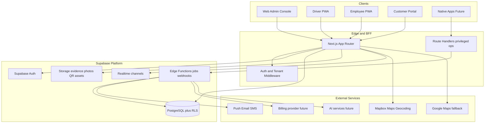

# WorkOps — Software Architecture & Development Roadmap

**Document status:** Master blueprint (architecture only — no SQL, no UI code, no implementation in this phase)  
**Product:** WorkOps  
**Current codebase reality:** Phase 1 foundation is already shipped in [`FleetInvoice/`](e:\Code Work\Fleet Invoice\FleetInvoice) (invite-only Supabase auth, organisations, RBAC, drivers/employees/vehicles/companies/areas/sites/pickup points, dashboard shell). This roadmap treats that as **Foundation v1**, then sequences everything required for commercial scale.

---

## 1. Executive Summary

### Vision
WorkOps is a **multi-tenant Workforce Operations Platform**. Transport is the first industry module, not the product ceiling. The platform must support hundreds of organisations and eventually thousands of concurrent users across dispatch, attendance, billing, compliance, analytics, and AI-assisted operations — without architectural rewrites between phases.

### Long-term business goals
- Sell per-organisation subscriptions (tiered seats, modules, white-label later)
- Become the system of record for workforce movement, attendance, and billing
- Expand modules independently (fleet, payroll, GPS, customer portal) behind one tenancy and identity model
- Enable API/partner integrations without exposing cross-tenant data
- Support web first, then driver/employee mobile and customer portals on the same domain model

### Why key architectural decisions were chosen

| Decision | Rationale |
|----------|-----------|
| **Next.js App Router + TypeScript** | One codebase for UI + BFF; strong typing; edge-ready middleware for auth/tenancy |
| **Supabase (Postgres + Auth + Storage + Realtime)** | Managed Postgres with RLS is the correct multi-tenant security primitive; Auth/Storage/Realtime reduce glue until scale demands specialty services |
| **Organisation as tenant root** | Every business row keyed by `organisation_id`; isolation is a database invariant, not an app convention |
| **Invite-only auth** | Enterprise sales motion; reduces abuse; matches controlled onboarding |
| **Feature-module folders (`features/`, `services/`)** | Teams can own modules; transport logic cannot leak into auth/org foundation |
| **Permission map in app + RLS in DB** | UI can hide; DB must enforce. Defense in depth |
| **Soft deletes + UUIDs + audit columns** | SaaS recovery, auditability, safe migrations |
| **Defer specialty infra (Kafka, dedicated GPS, separate billing engine)** | Avoid premature complexity; introduce when Phase metrics demand it |

---

## 2. Overall System Architecture



### Layer responsibilities

**Frontend (Next.js)**  
Admin console, later driver/employee portals as route groups or separate apps sharing packages. TanStack Query for server state; RHF+Zod for forms; shadcn design system; PWA shell.

**Backend**  
Primary data path: Supabase client with RLS. Privileged operations (invite emails, billing webhooks, GPS ingest, report generation) via Next.js Route Handlers and/or Supabase Edge Functions using service role only inside trusted boundaries.

**Database**  
Single Postgres project initially; schema modularized by domain; all tenant tables carry `organisation_id`. Partition/sharding strategy only after measured hotspots (likely `trip_events`, `gps_points`).

**Authentication**  
Supabase Auth (email/password initially; SSO/SAML in commercial tiers). Profiles 1:1 with `auth.users`. Memberships carry role per organisation. Platform Owner via `profiles.is_platform_owner`.

**Storage**  
Org-scoped buckets/prefixes for logos, incident photos, QR assets, invoice PDFs. Storage RLS or signed URLs tied to membership.

**Realtime**  
Channels scoped by `organisation_id` (and trip/dispatch room). Used for live trip status, dispatcher board, GPS presence — not for all CRUD.

**Notifications**  
Outbox table + Edge Function worker → email (transactional), later SMS/push. Prefer durable outbox over fire-and-forget from the browser.

**Maps**  
Mapbox as primary (GL JS + Directions/Geocoding). Google Maps as optional provider behind an adapter interface so modules never hardcode one SDK.

**QR verification**  
Signed, short-lived tokens (org + trip + employee + expiry). Verify server-side; log immutable attendance events.

**GPS**  
Mobile/PWA publishes points to an ingest endpoint → validate membership → insert `gps_points` (or time-series store later). Dispatcher consumes aggregated last-known + trail via Realtime or polled summaries.

**Reporting**  
OLTP queries for Phase 1–5 cards; later materialized views / nightly rollups / warehouse export for heavy analytics.

**Future AI**  
Separate inference services called from Edge Functions; never write AI output as source of truth without human/ops confirmation for scheduling/routing; audit prompts/responses per org.

---

## 3. Folder Structure

Target enterprise layout (extends current WorkOps tree):

```text
app/                      # Routes only — compose features, no business logic
  (auth)/                 # Login, forgot password
  (dashboard)/            # Authenticated admin console
  (driver)/               # Driver portal route group (future)
  (employee)/             # Employee portal
  (customer)/             # Customer portal (future)
  api/                    # Route Handlers (privileged / webhooks / ingest)
  invite/                 # Accept invitation
components/
  ui/                     # Design-system primitives (shadcn)
  layout/                 # Shell, sidebar, headers, org switcher
  shared/                 # DataTable, PageHeader, EmptyState, StatCard
  forms/                  # FormDialog, field helpers
features/<domain>/
  components/             # Domain UI
  hooks/                  # TanStack Query hooks
  schemas/                # Zod
  # optional: constants.ts, types.ts — keep domain local
services/                 # Supabase/data access — one file per aggregate
lib/
  auth/                   # Session, guards
  permissions/            # Role → permission matrix
  supabase/               # Browser/server/middleware clients
  maps/                   # Map provider adapters (future)
  notifications/          # Outbox helpers (future)
hooks/                    # Cross-cutting hooks only
types/                    # Shared domain + generated DB types
utils/                    # Pure helpers (format, errors, query keys)
packages/ (future monorepo)
  domain/                 # Shared types/validators for web + mobile
  config/                 # ESLint/TS configs
database/
  migrations/             # Canonical SQL — ordered, immutable once applied
  seeds/                  # Non-prod seeds only
supabase/
  migrations/             # CLI mirror of database/migrations
  functions/              # Edge Functions
docs/                     # ADRs, runbooks, API contracts
tests/
  unit/ e2e/ rls/         # Including RLS policy tests
```

**Why this shape exists**
- `app/` stays thin → routes never become god-files
- `features/` isolate modules → Phase 6 GPS cannot rewrite Phase 1 auth
- `services/` centralize data access → one place for org scoping and soft-delete filters
- `database/` is source of truth → app never “invents” schema
- Future `packages/` enables mobile/customer apps without copy-paste

---

## 4. Database Planning (entities only — no SQL)

### Core tenancy & identity

| Entity | Purpose | Relationships | Scale / indexes | Security |
|--------|---------|---------------|-----------------|----------|
| **Organisation** | Tenant root | Owns all business data | Unique `slug`; index `status` | Platform Owner manage; members read own |
| **Profile** | Global user identity | 1:1 auth.users | Index email | Self update; platform read |
| **OrganisationMember** | User↔org role | Org, Profile | Unique (org,user); index user_id | Admin manage; RLS by membership |
| **Invitation** | Invite-only onboarding | Org, role, token | Unique token; pending (org,lower(email)) | Admin create; accept via RPC |
| **OrganisationSetting** | Feature flags, branding | Org 1:1 or jsonb on org | — | Admin manage |
| **AuditLog** | Immutable change trail | Org, actor, entity | Index (org, created_at) | Insert-only; no update |

### Master data (shipped / stabilize)

| Entity | Purpose | Relationships | Scale / indexes | Security |
|--------|---------|---------------|-----------------|----------|
| **Company** | Client company served by org | Org | (org, name) | Member read; ops manage |
| **Area** | Geographic grouping | Org | (org, name) | Same |
| **Site** | Worksite / destination | Org, Company?, Area? | (org, company_id) | Same |
| **PickupPoint** | Boarding location | Org, Site?, Area? | (org, site_id); lat/lng later GiST | Same |
| **Driver** | Driver master | Org; optional link Profile | (org, status); license unique per org | Same |
| **Employee** | Passenger/workforce | Org, Company?, Site?; optional Profile | (org, employee_number) | Same |
| **Vehicle** | Fleet asset | Org | (org, registration) unique | Same |

### Operations (future phases)

| Entity | Purpose | Relationships | Scale / indexes | Security |
|--------|---------|---------------|-----------------|----------|
| **Route** | Reusable path template | Org | (org, code) | Dispatcher+ |
| **RouteStop** | Ordered stops | Route → PickupPoint/Site | (route_id, sequence) | Dispatcher+ |
| **Schedule** | Recurring plan | Org, Route, windows | (org, effective dates) | Dispatcher+ |
| **Trip** | Executable instance | Org, Route?, Vehicle?, Driver?, Schedule? | (org, service_date, status); hot table | Role-scoped |
| **TripAssignment** | Driver/vehicle on trip | Trip | Unique active assignment | Dispatcher+ |
| **TripPassenger** | Employees on trip | Trip, Employee | (trip_id, employee_id) | Limited employee self-read |
| **TripEvent** | Status machine log | Trip | (trip_id, created_at) | Append-heavy |
| **AttendanceEvent** | Boarding/alighting | Org, Trip?, Employee, method (QR/manual/GPS) | (org, occurred_at); (employee_id, day) | Immutable inserts |
| **QrToken** | Issued boarding token | Org, Trip, Employee, expiry, signature ref | Token hash unique | Verify RPC only |

### GPS & dispatch

| Entity | Purpose | Relationships | Scale / indexes | Security |
|--------|---------|---------------|-----------------|----------|
| **GpsDevice** / driver session | Publisher identity | Driver/Vehicle | — | Device auth |
| **GpsPoint** | Raw trail | Org, Trip?, Vehicle/Driver | **BRIN/time** or partition by month; (org, recorded_at) | Ingest service role; read dispatcher+ |
| **Geofence** | Site/pickup fences | Org, Site/Pickup | Spatial index | Admin manage |

### Billing & payroll (later)

| Entity | Purpose | Relationships | Scale notes | Security |
|--------|---------|---------------|-------------|----------|
| **Contract** / **RateCard** | Pricing rules | Org, Company | Versioned rates | Finance roles |
| **Invoice** / **InvoiceLine** | Billing | Org, Company, Trip refs | Period indexes | Strict role |
| **Payment** | Settlements | Invoice | — | Finance |
| **PayrollRun** / **PayrollLine** | Driver pay | Org, Driver, period | — | Highly restricted |

### Platform / commercial

| Entity | Purpose | Notes |
|--------|---------|-------|
| **Subscription** / **Plan** / **ModuleEntitlement** | SaaS packaging | Platform Owner; feature gating |
| **NotificationOutbox** | Durable notify queue | Worker drains |
| **IntegrationCredential** | API keys / OAuth for partners | Encrypted secrets; org-scoped |
| **WhiteLabelConfig** | Branding domains | Custom domain → org |

**Future scalability notes:** Prefer partitioning `gps_points` and `trip_events` before sharding orgs. Keep hot read models (dispatcher board) as materialized views refreshed frequently rather than denormalizing everywhere.

---

## 5. User Roles & Permissions

### Role catalog

| Role | Scope | Intent |
|------|-------|--------|
| **Platform Owner** | Global | Create orgs, billing plans, support break-glass |
| **Organisation Admin** | Org | Full org config, users, all modules enabled for plan |
| **Manager** | Org | Ops oversight; users view; most master + trips manage |
| **Dispatcher** | Org | Live ops: trips, assignments, GPS board |
| **Supervisor** | Org | Field oversight; attendance exceptions; limited trip edit |
| **Company Manager** | Org + **company_id scope** | See only their client company’s employees/trips/invoices |
| **Driver** | Org (self) | Own trips, navigation, status updates |
| **Employee** | Org (self) | Own schedule, QR boarding, trip status |
| **Finance** (future) | Org | Invoices, payroll read/manage |
| **Auditor** (future) | Org | Read-only compliance |
| **API Service Account** (future) | Org | Scoped machine credentials |

### Permission design principles
- Permissions are `resource:action` (e.g. `trips:dispatch`, `attendance:verify`, `invoices:manage`)
- **Company Manager** adds attribute-based filter: `company_id IN allowed_companies` enforced in RLS using a membership attributes table or `organisation_members.constraints` jsonb
- Platform Owner bypasses org role checks but still logs audit
- Driver/Employee never receive broad SELECT on other people’s PII

### Matrix (summary — expand in `lib/permissions` as phases unlock)

- **Platform Owner:** all + `organisations:*` + `billing:platform`
- **Org Admin:** all org modules + `users:manage` + `settings:manage`
- **Manager:** master data + trips + reports; users view
- **Dispatcher:** trips/routes/vehicles/GPS live; limited master edit
- **Supervisor:** trips view/update status; attendance manage exceptions
- **Company Manager:** companies(self), employees(self), trips(self), invoices(self) view
- **Driver:** `trips:self`, `gps:publish`, `profile`
- **Employee:** `trips:self`, `attendance:self`, `profile`

---

## 6. Multi-Tenant Architecture

**Isolation model:** Shared database, shared schema, **row-level isolation** via `organisation_id` + RLS. Chosen over database-per-tenant for operational simplicity at hundreds of companies; revisit only if a whale customer requires dedicated isolation.

**Data ownership:** Organisation owns rows. Users access only through active membership. Soft-deleted tenants retain data for retention policy then hard-purge jobs.

**RLS strategy:**
- Helper functions: `is_platform_owner()`, `is_org_member(org)`, `has_org_role(org, roles[])`, later `has_company_scope(org, company)`
- SELECT policies require membership + `deleted_at IS NULL`
- WRITE policies role-gated
- RPCs for invite accept / QR verify / GPS ingest (security definer, tightly validated)
- Never expose service role to the browser

**Scalability:** Connection pooling (Supabase pooler); avoid N+1 via Query; cache org settings; move GPS to partitioned tables; optional read replicas for reporting.

**White-label:** `WhiteLabelConfig` (logo, colors, custom domain) resolved in middleware by host → `organisation_id`. Same codebase; theme tokens override CSS variables.

---

## 7. UI Architecture

**Layouts**
- Auth layout (minimal, brand-forward)
- Admin app shell: sidebar + top bar + org switcher (current)
- Driver / Employee / Customer shells (future) — mobile-first, fewer nav items

**Dashboards**
- Admin: entity counts → later SLA, on-time %, open trips
- Dispatcher: map + trip kanban (Phase 6)
- Role-home redirects after login

**Navigation**
- Permission-filtered nav config (already in [`lib/navigation.ts`](e:\Code Work\Fleet Invoice\FleetInvoice\lib\navigation.ts))
- Module entitlements hide locked commercial modules

**Reusable components**
- DataTable, FormDialog, PageHeader, StatCard, EmptyState, ConfirmDialog, StatusBadge (exist)
- Future: MapCanvas, TripTimeline, AttendanceScanner, ReportChart

**Design system**
- shadcn/ui + Tailwind tokens; WorkOps neutral + blue accent (already in globals)
- Purposeful fonts via `next/font` (heading + sans)

**Theme / responsive / a11y**
- `next-themes` light/dark
- Mobile sidebar sheet; touch targets for driver PWA
- WCAG AA target: focus rings, contrast, labels on all inputs, keyboard tables

---

## 8. API Planning (design only)

**Style:** Prefer Supabase PostgREST for CRUD under RLS. Add **Route Handlers / Edge Functions** for privileged or multi-step workflows. Version public HTTP API as `/api/v1/...` when partners need it.

| Module | Primary operations | Surface |
|--------|--------------------|---------|
| **Authentication** | login, logout, reset, session refresh, SSO later | Supabase Auth + `/auth/callback` |
| **Users** | list members, invite, revoke, role change, suspend | RPC `create_invitation` / `accept_invitation` + table CRUD |
| **Organisations** | CRUD (platform), settings | Tables + RLS |
| **Drivers / Employees / Vehicles / Companies / Areas / Sites / PickupPoints** | CRUD, soft delete, search | Tables |
| **Routes / Schedules** | CRUD templates, publish | Tables |
| **Trips** | create from schedule, assign, status transitions, cancel | Tables + `trip_events`; RH for complex transitions |
| **Attendance** | issue QR, verify QR, manual exception | RPC verify; append `attendance_events` |
| **GPS** | ingest batch points, last-known, trail query | `/api/v1/gps/ingest` (authenticated); read via views |
| **Invoices** | generate period, void, PDF | Edge job + Storage |
| **Reports** | summary cards, export CSV | RH + SQL views |
| **Notifications** | enqueue, list preferences | Outbox + worker |
| **Settings** | org profile, modules, map keys (server-side only) | Tables |
| **Webhooks** | billing, SMS delivery receipts | `/api/webhooks/*` |

**Contract rules:** Zod validate all inputs; never trust client `organisation_id` without membership check; idempotency keys on ingest and billing.

---

## 9. Feature Roadmap (detailed phases)

> **Alignment note:** Code already delivers much of “classic Phase 1 + Phase 2 master data.” Phases below are the **forward master plan**. Phase 0 documents hardening of what exists; Phase 1+ below match the product journey you outlined, adjusted for reality.

### Phase 0 — Foundation hardening (current codebase → production-ready)
- **Objectives:** Make Foundation v1 commercially safe
- **Features:** RLS policy tests; audit log; env/secrets checklist; org create auto-membership; invitation email delivery; Supervisor & Company Manager roles designed into permission model (schema migration for new roles)
- **DB:** `audit_logs`; extend `app_role`; optional `member_scopes`
- **FE/BE:** Permission updates; invite email via Edge Function; docs/ADR
- **Testing:** RLS suite; auth invite e2e
- **Complexity:** M | **Depends on:** Existing Phase 1 schema

### Phase 1 — Platform foundation (conceptual complete / maintain)
- Auth, organisations, roles, UI shell, database tenancy — **shipped**
- Ongoing: SSO prep, session hardening

### Phase 2 — Master data completeness — **shipped**
- **Objectives:** Production-quality reference data
- **Features:** Import CSV; archive/restore UX; driver↔profile link; vehicle docs metadata; company manager site scoping
- **DB:** `00003_phase2_master_data.sql` — profile_id, vehicle_documents, partial unique indexes
- **Complexity:** S–M | **Depends on:** Phase 0

### Phase 3 — Routes, scheduling, trip planning — **in progress / shipped in app**
- **Objectives:** Plan work before execution
- **Features:** Routes + ordered stops; schedules; generate trips; pickup point binding
- **DB:** `00004_phase3_routes_scheduling.sql` — `routes`, `route_stops`, `schedules`, `trips` (planned|cancelled), `generate_trips` RPC
- **FE:** Routes / Schedules / Trips pages under dashboard
- **BE:** Idempotent `generate_trips` RPC
- **Testing:** Unit tests for occurrence/generation_key helpers
- **Complexity:** L | **Depends on:** Phase 2
- **ADR:** `docs/adr/0003-phase3-routes-scheduling.md`

### Phase 4 — Driver portal & trip workflow — **in progress / shipped in app**
- **Objectives:** Drivers execute trips
- **Features:** Driver portal route group (`/driver`); admin trip assignment; start/arrive/complete; Google Maps deep-link navigation; offline-tolerant status queue (future)
- **DB:** `00005_phase4_trip_status_enum.sql` — extends `trip_status` (assigned/in_progress/completed); `00006_phase4_driver_portal.sql` — `trip_assignments`, `trip_events`, `current_driver_id`, `assign_trip` and `transition_trip` RPCs
- **FE:** Admin Trips page gains Assign dialog + driver column; `app/(driver)/driver` lists a driver's assigned/in-progress trips with Start/Arrive/Complete actions
- **BE:** All workflow mutations go through `assign_trip` / `transition_trip` security-definer RPCs (never direct table writes from the client)
- **Testing:** Unit tests for `canTransition`/`nextStatus` status machine and `trips:self` permission
- **Complexity:** L | **Depends on:** Phase 3
- **ADR:** `docs/adr/0004-phase4-driver-portal.md`

### Phase 5 — Fuel monitoring, role hubs & weekly company invoices — **shipped in app**
- **Objectives:** Capture fuel cost drivers; role-specific homes; minimal company billing
- **Features:** `fuel_fillups` + monotonic odometer RPC; admin/driver fuel UI; company hub; weekly fuel invoices; post-login hub redirect by role
- **DB:** `00007_phase5_fuel_and_invoices.sql` — `fuel_fillups`, `invoices`, `invoice_lines`, `vehicles.company_id`, `log_fuel_fillup`, `generate_weekly_fuel_invoice`
- **FE:** `/fuel`, `/invoices`, `/driver/fuel`, `/company` (+ fuel/fleet/invoices); hubs via `/hub`
- **Complexity:** L | **Depends on:** Phase 4
- **ADR:** `docs/adr/0005-phase5-fuel-hubs-invoices.md`

### Phase 6 — Employee portal, QR boarding, notifications — **shipped in app**
- **Objectives:** Verify presence
- **Features:** Employee schedule view; QR issue/scan; trip confirmation; email via outbox on issue/board
- **DB:** `00008_phase6_employee_qr_attendance.sql` — `employees.profile_id`, `qr_tokens`, `attendance_events`, `current_employee_id`, `issue_qr_token`, `scan_qr_token`
- **FE:** `/employee`, `/employee/board`, `/attendance`, `/driver/scan`; hub redirect employee → `/employee`
- **Complexity:** L | **Depends on:** Phase 4–5
- **ADR:** `docs/adr/0006-phase6-employee-qr-attendance.md`

### Phase 7 — Live GPS, maps, dispatcher dashboard — **shipped in app (MVP)**
- **Objectives:** Real-time operations control (MVP)
- **Features:** GPS ingest; Mapbox last-known board; trip kanban; circular geofences + enter/exit on ingest
- **DB:** `00009_phase7_gps_and_dispatch.sql` — `gps_points`, `gps_last_positions`, `geofences`, `geofence_events`, `ingest_gps_points`, `haversine_m`
- **FE:** `/dispatch`, `/geofences`, `/driver/location`; poll ~10s (Realtime deferred)
- **Complexity:** XL (MVP subset) | **Depends on:** Phase 4–6
- **ADR:** `docs/adr/0007-phase7-gps-dispatcher.md`

### Phase 8 — Full billing, payroll, reports — **shipped (MVP)**
- **Objectives:** Monetize operations data beyond fuel MVP
- **Features (MVP shipped):** Rate cards; period invoices; paid status; payroll runs; operational reports with CSV export (`/reports`, `/company/reports`)
- **DB:** `00010`–`00012` — rate cards, payroll tables & RPCs (reports are read-only on existing tables)
- **Deferred:** Payslips; accounting integrations; warehouse/BI
- **Complexity:** XL | **Depends on:** Phases 3–6 data quality
- **ADR:** `docs/adr/0008-phase8-billing.md`, `docs/adr/0009-phase8-payroll.md`, `docs/adr/0010-phase8-reports.md`

### Phase 9 — Customer portal, analytics, subscriptions, white-label, AI
- **Objectives:** Multi-sided SaaS platform
- **Features (shipped MVP):** Subscriptions + module entitlements + optional Stripe; expanded company hub; white-label host → theme
- **DB:** `00013` plans/subscriptions/entitlements; `00014` white_label_configs
- **Deferred:** Usage analytics dashboards; AI schedule/report assist + `ai_runs`
- **Complexity:** XL | **Depends on:** Phase 8 commercial model
- **ADR:** `docs/adr/0013-phase9-subscriptions.md`, `docs/adr/0014-phase9-white-label.md`

---

## 10. Future Expansion (explicit backlog)

Dispatch automation, route optimisation (OR-Tools/Mapbox Optimization), GPS tracking, live maps, QR boarding, payroll, fuel tracking, maintenance, accidents/incidents, compliance packs, AI scheduling/optimisation/reports, customer portal, native mobile apps, public REST/GraphQL API, payroll/accounting integrations (Xero/Sage), SSO/SAML, data warehouse export.

Each expansion **plugs into** organisation tenancy + permissions + outbox + audit — never a parallel stack.

---

## 11. Technical Debt Prevention

| Area | Standard |
|------|----------|
| **Naming** | `snake_case` DB; `PascalCase` types; `kebab-case` routes; `*.service.ts` data layer |
| **Folders** | Business logic only in `features/` + `services/`; no domain code in `components/ui` |
| **Reuse** | New list screens must use DataTable/Entity patterns; no one-off tables |
| **Testing** | Unit (pure utils/permissions); RLS integration tests mandatory for new tables; Playwright for auth/invite/trip happy paths |
| **Docs** | ADR in `docs/adr/` for each phase-starting decision; README stay onboarding-only |
| **Versioning** | App semver; migrations strictly forward-only numbered; public API `/v1` |
| **Migrations** | Expand/contract pattern for breaking changes; never edit applied migration files |
| **Coding** | Strict TS; no `any`; Zod at boundaries; explicit error types; service role banned in client bundles (lint rule) |

---

## 12. Risks (pre-development / pre-scale)

| Risk | Impact | Mitigation |
|------|--------|------------|
| RLS bugs → cross-tenant leak | Critical | Automated RLS tests; least-privilege roles; security reviews each phase |
| GPS table unbounded growth | High cost/latency | Partitioning plan before Phase 7 GA; retention jobs |
| Overusing Realtime | Cost/complexity | Realtime only for live ops; CRUD stays request/response |
| God modules (trips) | Unmaintainable | Subdomains: planning vs execution vs attendance |
| Premature microservices | Slow delivery | Modular monolith on Supabase until metrics force split |
| Map vendor lock-in | Rewrite cost | Provider adapter interface from first map feature |
| Invite-only friction | Sales friction | Later: domain-capture signup as optional entitlement — keep invite as default |
| Company Manager scoping errors | Data leak between clients | Dedicated RLS helpers + fixture tests |
| AI hallucinated routes/schedules | Safety/ops failure | Suggest-only; require dispatcher confirm; audit |
| Single-region Supabase | Latency/DR | Document RPO/RTO; paid plan HA; backup drills |

---

## Immediate next step

**P0 production hardening tooling is shipped** (ADR [`0011`](./adr/0011-p0-production-hardening.md)); operator go-live: [`retail-go-live.md`](./runbooks/retail-go-live.md); first Vercel project **`workops`**: [`vercel-deploy.md`](./runbooks/vercel-deploy.md). **P1 invoice print is shipped** (ADR [`0012`](./adr/0012-p1-invoice-print.md)). **Phase 9a–9c tooling is in the repo** (ADRs [`0013`](./adr/0013-phase9-subscriptions.md), [`0014`](./adr/0014-phase9-white-label.md)) — apply migrations `00013`–`00014` on WorkOps Supabase and paste Stripe/Vercel secrets for live self-serve.

**Next:** Operator finish Vercel env + Auth URLs + cron; apply Phase 9 SQL; optional Stripe live keys. P3 (AI, integrations, SSO) remains backlog.

### Retail readiness roadmap (remaining)

| Priority | Workstream | Status / blocks |
|----------|------------|-----------------|
| **P0** | Env secrets, Auth URLs, `vehicle-docs`, outbox cron | **Tooling + `workops` Vercel project** — paste secrets on host |
| **P0** | RLS SQL gates + Playwright smoke | **Smoke scaffold shipped** — extend with `E2E_*` creds |
| **P1** | Billing polish (invoice PDF/print, company portal UX) | **Shipped** — HTML print / browser PDF |
| **P1** | GPS ops readiness (retention/partitions; Mapbox URL restrict; optional Realtime) | Scale (deferred) |
| **P2** | Phase 9 subscriptions / entitlements / feature gating | **Shipped in app** — apply `00013` + Stripe keys |
| **P2** | Customer portal (beyond invite-only company_manager) | **Shipped** — hub summary + reports link |
| **P2** | White-label / custom domain | **Shipped in app** — apply `00014` + DNS |
| **P3** | Analytics / AI assist (suggest-only, human confirm) | Differentiation |
| **P3** | Integrations (Xero/Sage, public `/v1` API, SSO/SAML) | Enterprise |
| **Backlog** | Native mobile, OR-Tools routing, maintenance/incidents | Post-GA |

**Minimum retail live:** P0 secrets live + Phase 8 on a paid Supabase project with backups and verified email domain. **Self-serve SaaS packaging** requires P2 (Phase 9). Without Phase 9 you can still sell managed/ops deployments per organisation.

Deferred from Phase 7: monthly GPS partitions/retention, polygon fences, Realtime subscribe.

This document is the master blueprint. Implementation work should cite phase IDs and entity names from here before writing SQL or UI.
